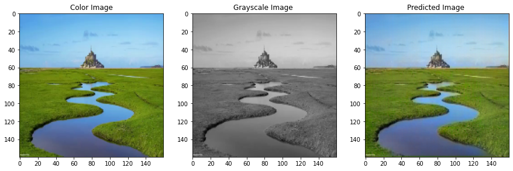

# imagecolorizer

An app that colorizes black and white images.



# Installation

This app requires cv2, on Linux this is installed using:

```shell
sudo apt-get install -y python3-opencv
```

[Poetry](https://python-poetry.org/) is used to manage dependencies, you can install it using:

```shell
pip install poetry
```

Install dependencies using:

```shell
poetry install
```